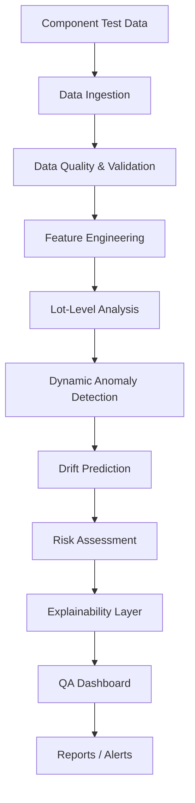
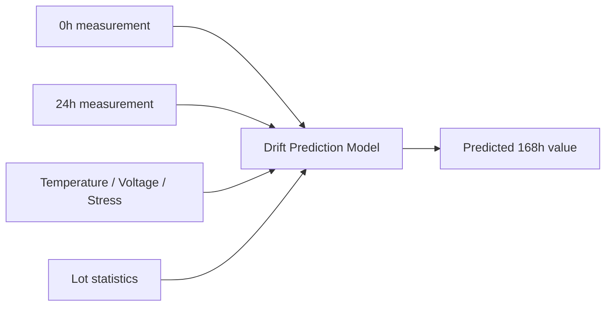
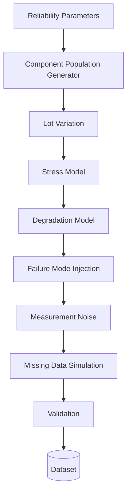
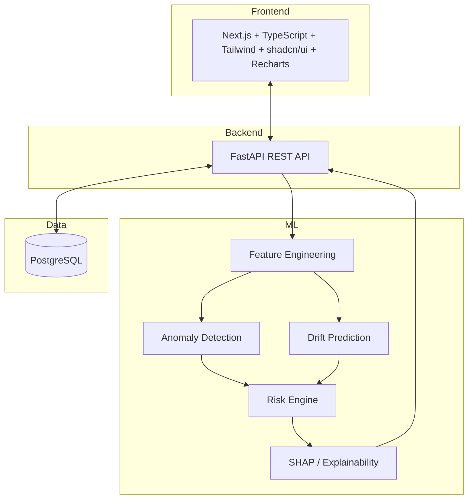
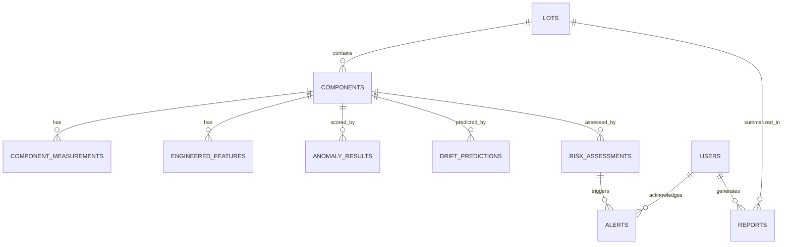
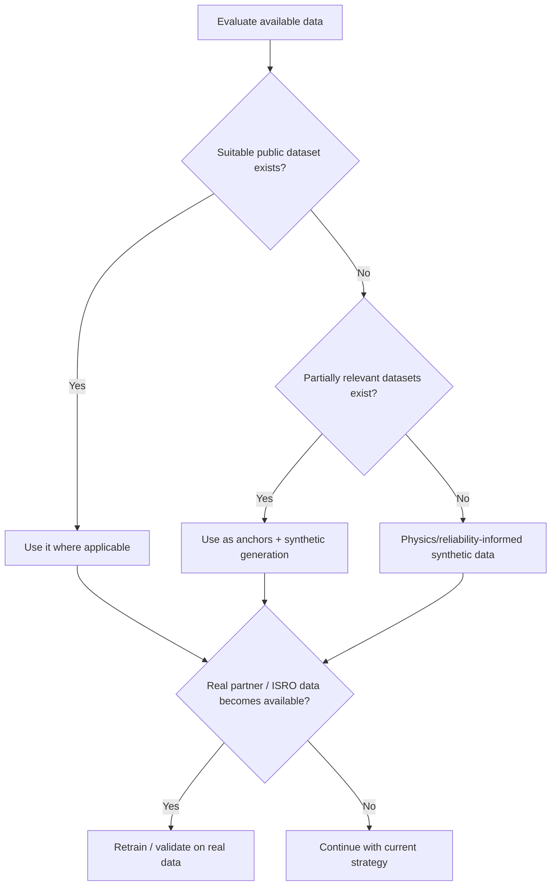

<div align="center">

# 🚀 SIH26170 — Component Reliability Intelligence Platform (CRIP)
### AI-Driven Anomaly Detection in Component Burn-In & Screening


</div>

<br>

> ### ⚠️ Read this first
> This README is **not documentation of a finished product** — it's the master planning blueprint the whole team works from: what to build, what data to use, how to model it, and how to divide the work. Every section separates **what SIH26170 actually requires** from **what we're proposing**, **assuming**, or **still need to validate**. Please don't quote anything here as "official ISRO data" unless it's explicitly tagged `[OFFICIAL REQUIREMENT]`.

<br>

## 🧭 How to use this document

- **New to the project?** Read Sections 1–3, then 6 (the dataset situation — this shapes everything).
- **Building the ML pipeline?** Sections 5, 7–14.
- **Building backend/frontend?** Sections 15–18.
- **Just here to know what to do this week?** Jump straight to [Section 23](#-23-first-7-days--extremely-detailed) and [Section 24](#-24-team-division).
- Every major section below is **collapsible** — click a heading to expand it. This keeps the file scannable instead of one giant scroll.

<br>

## 📑 Table of Contents

| # | Section | # | Section |
|---|---|---|---|
| 1 | [Executive Summary](#-1-executive-summary) | 18 | [User Interface](#-18-user-interface) |
| 2 | [Official PS Requirements](#-2-official-problem-statement-requirements) | 19 | [Demo Scenario](#-19-demo-scenario) |
| 3 | [Problem Understanding](#-3-problem-understanding) | 20 | [MVP](#-20-mvp) |
| 4 | [Proposed Solution](#-4-proposed-solution) | 21 | [Advanced Version](#-21-advanced-version) |
| 5 | [Core AI Modules](#-5-core-ai-modules) | 22 | [Development Roadmap](#-22-development-roadmap) |
| 6 | [Dataset Risk](#-6-dataset-availability--major-project-risk) | 23 | [First 7 Days](#-23-first-7-days--extremely-detailed) |
| 7 | [Synthetic Dataset Schema](#-7-synthetic-dataset-design) | 24 | [Team Division](#-24-team-division) |
| 8 | [Synthetic Failure Modes](#-8-synthetic-failure-modes) | 25 | [Risk Register](#-25-risk-register) |
| 9 | [Data Generation Method](#-9-data-generation-methodology) | 26 | [Dataset Mitigation Plan](#-26-dataset-risk--special-mitigation-plan) |
| 10 | [Data Quality Validation](#-10-data-quality-validation) | 27 | [What We Must Not Claim](#-27-what-we-must-not-claim) |
| 11 | [Train/Val/Test Strategy](#-11-train--validation--test-strategy) | 28 | [Research Requirements](#-28-research-requirements) |
| 12 | [Model Evaluation](#-12-model-evaluation) | 29 | [Experiment Tracking](#-29-experiment-tracking) |
| 13 | [Explainable AI](#-13-explainable-ai) | 30 | [Repository Structure](#-30-repository-structure) |
| 14 | [Risk Engine](#-14-risk-engine) | 31 | [Testing Strategy](#-31-testing-strategy) |
| 15 | [System Architecture](#-15-system-architecture) | 32 | [Success Criteria](#-32-success-criteria) |
| 16 | [Database Design](#-16-database-design) | 33 | [Future Deployment](#-33-future-real-world-deployment) |
| 17 | [API Design](#-17-api-design) | 34 | [Final Blueprint](#-34-final-project-blueprint) |

---

<a id="-1-executive-summary"></a>
<details open>
<summary><h2>1. 📋 Executive Summary</h2></summary>

Before a component (transistor, IC, MOSFET, connector, etc.) is cleared for use in a satellite, launch vehicle, or ground system, it goes through **burn-in and environmental screening**: it is stressed (temperature, voltage, vibration, power cycling) for an extended period, and its electrical parameters are measured at fixed checkpoints. Today, the standard way to judge "is this component okay?" is to check whether each measurement stays inside a fixed **datasheet limit** — an absolute pass/fail band.

The problem: a component can sit comfortably inside its absolute limit and still be quietly telling a different story — drifting faster than every other component from its manufacturing lot, or degrading in a pattern that historically precedes failure — and a threshold check will wave it through anyway. Threshold checks also give a QA inspector a pass/fail stamp with **no explanation**, which makes the result hard to trust or audit.

SIH26170 asks for a system that goes beyond static thresholds: one that evaluates a component **relative to its lot**, uses **early-life measurements** to flag components likely to drift out of safe behaviour later, and **explains its reasoning** in language a QA inspector can act on.

Our proposed system — provisionally named the **Component Reliability Intelligence Platform (CRIP)** — ingests burn-in measurement data, computes lot-relative statistics, runs anomaly-detection and drift-prediction models, produces a human-readable risk explanation, and surfaces it all through a QA-facing dashboard.

> **One-line pitch:**
> *"Instead of asking only whether a component is within its absolute limit, our system determines whether it is behaving abnormally relative to its lot and whether its degradation trajectory indicates future risk."*

**What this project is explicitly NOT:** a replacement for ISRO's official qualification, screening, or certification process. It's a decision-support prototype for the SIH hackathon, trained on synthetic and/or public surrogate data — a demonstration of methodology, not a flight-ready system.

</details>

---

<a id="-2-official-problem-statement-requirements"></a>
<details open>
<summary><h2>2. ✅ Official Problem Statement Requirements</h2></summary>

Only what is explicitly asked for by SIH26170. Interpretation starts in Section 3.

| # | Requirement | Status |
|---|---|---|
| 1 | **Dynamic anomaly detection** on component measurements during burn-in/screening, beyond static thresholds | `OFFICIAL` |
| 2 | Detection must be **lot-relative** — judged against the statistical distribution of the component's own lot | `OFFICIAL` |
| 3 | Context is **burn-in / environmental screening** — time-based stress testing with checkpointed measurements | `OFFICIAL` |
| 4 | Must analyze **early measurements** (readings soon after burn-in starts) | `OFFICIAL` |
| 5 | Must perform **drift prediction** — estimating how parameters evolve later in the cycle | `OFFICIAL` |
| 6 | Drift prediction tied to a **168-hour** horizon | `OFFICIAL` |
| 7 | Output must be **explainable**, not a black-box score | `OFFICIAL` |
| 8 | Explanations must **justify decisions to a QA inspector** | `OFFICIAL` |

> #### 🔎 To be validated against the official PS PDF
> - Exact electrical parameters/measurements in scope
> - Exact checkpoint set beyond 168h (we assume 0h/24h/96h/168h — confirm this)
> - Any explicitly stated safety/drift criteria or numeric thresholds
> - Any required output format
> - Any explicitly named component types
>
> **Action item:** Before Day 1 ends, re-read the exact SIH26170 PDF from the SIH portal and replace paraphrases above with verbatim text. Don't build models assuming this table is complete.

</details>

---

<a id="-3-problem-understanding"></a>
<details>
<summary><h2>3. 🔬 Problem Understanding</h2></summary>

### In simple language
Picture a lot of 500 identical transistors. Before they're trusted in a satellite, they're baked in an oven, powered on, and measured at intervals — start, midway, end of a week (168h). If a transistor stays under the datasheet's worst-case limit the whole time, it's traditionally "fine."

But some "fine" transistors are quietly different from their 499 siblings. Maybe 5 of them are steadily drifting upward — still inside the limit, but heading somewhere none of the others are. That's a classic early sign of a **latent defect**. A pure threshold check can't see this, because it only asks *"sample vs. absolute limit,"* never *"sample vs. its peers"* or *"sample now vs. its own trajectory."*

### Technically

| Term | Meaning |
|---|---|
| **Burn-in testing** | Operating components under elevated stress to accelerate early-life ("infant mortality") failures before deployment — rooted in the reliability "bathtub curve" |
| **Screening** | Testing every unit (not a sample) against pass/fail criteria; burn-in is one screening technique among several |
| **Absolute threshold check** | `PASS if measurement ∈ [datasheet_min, datasheet_max]` — simple, auditable, but context-blind |
| **Lot-relative behaviour** | Evaluating a component against its own lot's `mean`/`std` — "normal" is defined locally |
| **Latent defect** | A defect that doesn't cause immediate out-of-spec readings but raises future failure probability — the entire reason burn-in exists |
| **Parameter drift** | `Δ = value(t2) − value(t1)` — often more diagnostic than any single absolute reading |

**Why early prediction matters:** catching a component that's *going to* drift out of safe territory at 24h — rather than discovering it at 168h — shortens screening cycles.

**Why false negatives matter more here:** a defective unit that passes (false negative) can propagate into a mission-critical failure; a false positive only costs extra inspection time. This asymmetry shapes every metric decision in this project (Section 12).

**Why explainability matters:** an inspector signing off on a rejection needs a defensible, human-readable reason — "anomaly score = 0.83" alone won't survive an audit.

#### 🧪 Hypothetical example *(not real ISRO data)*

| | Value |
|---|---|
| Datasheet absolute limit *(hypothetical)* | ≤ 500 units |
| This component's 168h reading | 410 units |
| Lot average at 168h | 260 units |
| Lot standard deviation at 168h | 40 units |

Well inside the absolute limit (`410 < 500` → PASS under threshold logic). But relative to its lot: `(410 − 260) / 40 ≈ 3.75σ` above the lot mean — a strong outlier a threshold-only system would never catch. This is exactly the gap SIH26170 asks us to close.

</details>

---

<a id="-4-proposed-solution"></a>
<details>
<summary><h2>4. 🏗️ Proposed Solution</h2></summary>

**Provisional name:** Component Reliability Intelligence Platform (CRIP)



<details>
<summary>📦 Module-by-module breakdown (click to expand)</summary>

**1. Data Ingestion** — accepts CSV/Excel or API data → schema validation, ID normalization → structured DB records. *MVP: CSV upload + schema check. Advanced: streaming ingestion, lab-instrument API.*

**2. Data Quality & Validation** — range checks, missing-value/duplicate/timestamp checks (Section 10) → validated dataset + quality report. *MVP: rule-based checks. Advanced: automated dashboard.*

**3. Feature Engineering** — drift deltas, rate of change, lot z-scores → feature table. *MVP: deltas + lot z-score. Advanced: robust stats, learned embeddings.*

**4. Lot-Level Analysis** — computes the reference distribution each component is judged against (mean/median, std/MAD, trend). *MVP: mean/std per lot. Advanced: robust estimators, cross-lot baselines.*

**5–7. Anomaly Detection / Drift Prediction / Risk Assessment** — see Sections 5 and 14.

**8. Explainability Layer** — see Section 13.

**9. QA Dashboard** — see Section 18.

**10. Reports / Alerts** — *MVP: on-screen summary + CSV export. Advanced: PDF reports, email/Slack alerts, scheduled batches.*

</details>
</details>

---

<a id="-5-core-ai-modules"></a>
<details>
<summary><h2>5. 🤖 Core AI Modules</h2></summary>

> **Golden rule: don't reach for the fanciest model first.** Establish a baseline, then justify complexity with a measured improvement.

### Module A — Dynamic / Lot-Relative Anomaly Detection

| Approach | Nature | Use as | Notes |
|---|---|---|---|
| Modified Z-score (median + MAD) | Robust statistical | **✅ Baseline — start here** | Simple, explainable, robust to outliers in the reference |
| Standard Z-score | Statistical | Simple baseline | Sensitive to outliers in the reference distribution |
| Isolation Forest | Unsupervised ML | **Good 2nd step** | Multivariate, non-linear; fairly explainable via path length |
| Local Outlier Factor | Unsupervised ML | Density-based cases | More expensive; good for lots with sub-clusters |
| One-Class SVM | Unsupervised ML | Optional experiment | Sensitive to kernel/hyperparams; less interpretable |
| Autoencoder | Deep learning | **Only if simpler models clearly underperform** | Needs more data than a hackathon dataset may offer |
| Ensemble | Hybrid | Strong for final system | Improves robustness; must still map back to explainable features |

**Anomaly score:** normalize whichever model's raw output (distance, path length, reconstruction error) to 0–1, always computed **relative to lot baselines** — never a fixed global threshold, or the "lot-relative" requirement isn't actually met.

### Module B — Early Drift Prediction



| Approach | Use as | Notes |
|---|---|---|
| Linear regression | **✅ Baseline — start here** | Fast, interpretable, sanity-check vs. "predict last known value" |
| Random Forest | 2nd step | Non-linear relationships + free feature importance |
| Gradient Boosting / XGBoost | **Strong default** | Best accuracy/interpretability trade-off for checkpoint-based tabular data |
| Classical time-series (ARIMA-family) | Only if checkpoint count justifies it | Burn-in typically has few checkpoints (e.g. 4), which limits this |
| LSTM/GRU | **Only if justified with evidence** | Needs more sequential data than a 4-checkpoint profile usually offers |

</details>

---

<a id="-6-dataset-availability--major-project-risk"></a>
<details open>
<summary><h2>6. 🚨 Dataset Availability — Major Project Risk</h2></summary>

> ### **The SIH26170 problem statement currently does not provide a public dataset.**
> This is a first-class project risk — not a footnote.

**Why this is a major challenge:**
- Real ISRO burn-in data is unavailable to a student team, and even fragments would likely be sensitive.
- Public datasets in adjacent domains don't exactly match "lot-relative burn-in screening with 0h/24h/96h/168h checkpoints."
- Synthetic data encodes **our assumptions** — a model trained purely on it can't be claimed to generalize to real ISRO hardware without independent validation.
- Any evaluation number from synthetic data must always be reported **with that caveat attached.**

### Data Strategy — Option A: Public reference datasets

| Dataset | Contains | Can support | Cannot support |
|---|---|---|---|
| **UCI SECOM** (semiconductor mfg, ~1,567 samples, ~590 features, ~14:1 imbalance) | Sensor/process measurements at a single point in time, pass/fail label | Feature-engineering practice, imbalance-handling validation | No multi-checkpoint burn-in trajectory or lot structure |
| **NASA PCoE Data Repository** (run-to-failure time-series) | Multiple electronic/electromechanical degradation datasets | Realistic degradation-curve shape reference | Not the exact SIH parameter set |
| **NASA IGBT Accelerated Aging Set** | Real semiconductor aging under thermal cycling | Physical plausibility check for synthetic curves | Doesn't cover lot-relative screening framing |
| **NASA MOSFET Thermal Overstress Set** | Same as above, different component | Same as above | Same as above |
| **Bosch Production Line Dataset** (Kaggle) | Manufacturing-line sensor + quality labels | Large-scale tabular QA pipeline practice | Not component-electrical/burn-in specific |

> ⚠️ **None of the above is the official SIH26170 dataset.** Never present them as ISRO data in a demo or report.

### Data Strategy — Option B: Synthetic generation *(primary strategy)*

A **physics/reliability-informed generator**, incorporating:

- Component-to-component & lot-to-lot variation
- Measurement noise, missing values/dropout
- Temperature effects (Arrhenius-style, where defensible)
- Gradual, accelerating & sudden degradation trajectories
- Intermittent + deliberately injected lot-relative anomalies
- Multiple distinct failure-trajectory shapes (Section 8)

<details>
<summary>Known principles vs. our assumptions</summary>

**Known physical/reliability principles we lean on:**
- The reliability bathtub curve (early-life, useful-life, wear-out failure rate)
- Arrhenius-style temperature acceleration of degradation (standard in accelerated life testing)
- Lot-to-lot / unit-to-unit variability is well-documented in semiconductor manufacturing

**Our modelling assumptions (clearly separate):**
- Specific numeric ranges, drift magnitudes, noise levels are **invented for prototype purposes** — tag as `[ASSUMED — TO BE VALIDATED]` in code/config
- The anomalous-vs-normal proportion in a synthetic lot is a modeling choice, not a real defect rate

</details>

### Data Strategy — Options C & D

- **C — Hybrid:** anchor degradation-curve shapes/noise to a public dataset (e.g. NASA PCoE), then generate SIH-specific trajectories on top. Defensible **as a shape reference**, but still label the output synthetic everywhere.
- **D — Real data / future:** the architecture (Sections 15, 26) lets a real dataset (ISRO or industrial partner) enter through the same ingestion pipeline **without redesigning** the detection/prediction/dashboard layers.

</details>

---

<a id="-7-synthetic-dataset-design"></a>
<details>
<summary><h2>7. 🗂️ Synthetic Dataset Design</h2></summary>

| Field | Type | Category |
|---|---|---|
| `Component_ID`, `Lot_ID`, `Component_Type` | string | metadata |
| `Temperature`, `Voltage`, `Stress_Level` | float/categorical | raw / stress condition |
| `Parameter_0h` / `_24h` / `_96h` / `_168h` | float | raw measurement |
| `Drift_0_24`, `Drift_24_96`, `Drift_96_168` | float | engineered feature |
| `Lot_Mean`, `Lot_STD`, `Lot_ZScore` | float | engineered feature |
| `Anomaly_Label`, `Failure_Mode`, `Severity` | bool/categorical | **label — synthetic ground truth only** |
| `Actual_168h` | float | evaluation ground truth |
| `Predicted_168h`, `Final_Status` | float/categorical | **model output — never a training input** |

**Leakage rules:**
- `Anomaly_Label` / `Failure_Mode` / `Severity` exist only because we control the generator — withhold from unsupervised training, use for evaluation only.
- `Predicted_168h` / `Final_Status` are outputs — never allowed as inputs anywhere, including the risk engine's own re-evaluation.
- `Actual_168h` must never be a feature when predicting 168h from 0h/24h data.

</details>

---

<a id="-8-synthetic-failure-modes"></a>
<details>
<summary><h2>8. 🧬 Synthetic Failure Modes</h2></summary>

| # | Class | Expected trajectory | Use in training | Use in testing |
|---|---|---|---|---|
| 1 | Normal | Flat/near-flat, small noise | ✅ Majority class | ✅ |
| 2 | Gradual degradation | Slow, steady monotonic drift | ✅ | ✅ |
| 3 | Accelerating degradation | Slow start, steep finish | ✅ (some held out) | ✅ — tests non-linearity handling |
| 4 | Sudden failure | Sharp jump between checkpoints | Sparingly (rare, like real infant-mortality) | ✅ — held-out emphasis |
| 5 | Intermittent anomaly | Spike then reverts | Sparingly | ✅ — tests over-reaction to noise |
| 6 | **Lot-relative anomaly** | Individually normal-looking, but shifted vs. lot peers | ✅ | ✅ — **core SIH-required case** |
| 7 | Measurement anomaly/noise | Isolated erroneous reading | ✅ (small amount) | ✅ — tests glitch vs. real-anomaly distinction |
| 8 | Missing/invalid | Null value at a checkpoint | ✅ | ✅ |

> Avoid unrealistic, arbitrarily huge jumps unless the class specifically calls for it (sudden failure). Magnitudes should be plausible even though exact numbers stay `[ASSUMED — TO BE VALIDATED]`.

</details>

---

<a id="-9-data-generation-methodology"></a>
<details>
<summary><h2>9. ⚙️ Data Generation Methodology</h2></summary>



**Mathematical building blocks — each with a reason, none for decoration:**

- **Gaussian / log-normal** distributions for component-to-component variation (log-normal keeps strictly-positive parameters realistic)
- **Lot-level offset sampling** for genuine lot-to-lot variation — what makes "lot-relative" detection meaningfully different from global thresholding
- **Linear / exponential / step curves** mapped directly onto the Section 8 failure-mode taxonomy
- **Arrhenius-type temperature scaling** — only where justified; the activation-energy constant is a documented assumption, not a sourced value
- **Additive Gaussian measurement noise**, layered on top of the "true" trajectory
- **Bernoulli/random missingness** for missing-data simulation

> ❌ Don't add equations purely to look scientific — every component above maps to a specific, explainable failure mode or noise source.

</details>

---

<a id="-10-data-quality-validation"></a>
<details>
<summary><h2>10. ✔️ Data Quality Validation</h2></summary>

**Synthetic Data Validation Checklist**

- [ ] No impossible values (e.g. negative where physically implausible)
- [ ] Missing-value rate matches the intended simulation %
- [ ] No duplicate `Component_ID` within a lot
- [ ] All 4 checkpoints present unless deliberately missing
- [ ] Checkpoint ordering internally consistent (0h < 24h < 96h < 168h)
- [ ] Trajectories visually inspected on a random sample
- [ ] `Anomaly_Label` / `Failure_Mode` proportions match intent (checked, not assumed)
- [ ] No unintended correlation between generation order and label
- [ ] `Lot_Mean`/`Lot_STD`/`Lot_ZScore` correctly recomputed, not hardcoded
- [ ] No label fields leaked into model input features
- [ ] Injected anomalies are actually statistically detectable by a naive check
- [ ] Re-running with a different seed preserves the same statistical properties

**Proving it isn't "just random":** plot per-class mean trajectories and show they're visually/statistically distinct; run the baseline detector against known injected anomalies and confirm recall is well above chance.

</details>

---

<a id="-11-train--validation--test-strategy"></a>
<details>
<summary><h2>11. 🔀 Train / Validation / Test Strategy</h2></summary>

> ❌ **Do not use random row-level splitting.** Multiple rows belong to the same component; multiple components belong to the same lot. Naive splits leak information.

**Recommended split — by Lot:**

```
Train:      Lots A – X   (majority)
Validation: Held-out lots, disjoint from Train
Test:       Completely unseen lots, disjoint from both
```

Additional holdouts to strengthen credibility:
- **Unseen failure trajectories** — at least one variant absent from training
- **Unseen parameter combinations** — hold out specific `Temperature × Stress_Level` pairs
- **Stress-condition holdout** — train/test on different stress condition subsets
- **Distribution shift testing** — simulate a "new manufacturing batch" and report degradation

</details>

---

<a id="-12-model-evaluation"></a>
<details>
<summary><h2>12. 📊 Model Evaluation</h2></summary>

**Anomaly Detection**

| Metric | Why it matters |
|---|---|
| Precision | Flagged-components-that-are-truly-anomalous rate — controls inspector workload |
| **Recall** | Caught-true-anomalies rate — **priority metric** |
| F1 | Balances precision/recall |
| False Positive Rate | Cost = extra inspection time |
| **False Negative Rate** | Cost = a defective component passes — **the metric we care about most** |
| ROC-AUC / PR-AUC | Threshold-independent; PR-AUC more informative under imbalance |
| Detection latency | How early (0h/24h vs. 168h) the anomaly is caught |

**Drift Prediction**

| Metric | Why it matters |
|---|---|
| MAE / RMSE | Average / large-error-penalized prediction error |
| R² | Overall explained variance |
| Error at critical range | Error specifically near the safety boundary |
| Prediction interval coverage | If uncertainty estimation is implemented |

> ⚠️ **Overall accuracy alone is insufficient.** A model that always predicts "normal" can show high accuracy while catching zero real anomalies. **False negatives must be tracked and minimized explicitly** — weighted more heavily than false positives everywhere.

</details>

---

<a id="-13-explainable-ai"></a>
<details>
<summary><h2>13. 💡 Explainable AI</h2></summary>

**Techniques:** SHAP, native feature importance, anomaly-contribution breakdown, lot-relative deviation display, trend/trajectory visualization, predicted-trajectory overlay.

**The system must answer: "Why was this component flagged?"**

```
HIGH RISK

Reasons:
- Unusually high lot-relative deviation (Z ≈ 3.7σ from lot mean at 168h)
- Abnormal drift pattern (Drift_96_168 in top 2% of lot)
- Predicted future value trends toward the defined safety boundary
- Behaviour differs significantly from peer components in the same lot
```

> Model-derived evidence and hard-coded rules must be **visually/textually distinguished** — e.g. SHAP statements labeled "model evidence," fixed rules labeled "rule-based check."

</details>

---

<a id="-14-risk-engine"></a>
<details>
<summary><h2>14. ⚖️ Risk Engine</h2></summary>

**Inputs:** anomaly score, drift prediction vs. safety boundary, lot-relative deviation, model confidence, any explicit safety criteria.

**Output:** `LOW` / `MEDIUM` / `HIGH` / `CRITICAL`

**On thresholds:** SIH26170 doesn't publish official numeric risk thresholds — none should be invented.

```
[PROPOSED — TO BE VALIDATED]
e.g. anomaly_score > 0.8 AND lot_zscore > 3  →  HIGH
```

**Why configurable, not hard-coded:** different component types/missions legitimately need different sensitivity; a configurable threshold layer (DB/config, adjustable by an admin/QA lead) stays auditable, whereas hard-coded numbers silently bake in unvalidated assumptions no one can inspect later.

</details>

---

<a id="-15-system-architecture"></a>
<details>
<summary><h2>15. 🏛️ System Architecture</h2></summary>



**Suggested stack** *(swap freely if the team finds a better fit)*

| Layer | Technology | Role |
|---|---|---|
| Frontend | Next.js, TypeScript, Tailwind, shadcn/ui, Recharts | QA dashboard, charts, drill-down views |
| Backend | Python, FastAPI | REST API, orchestration |
| ML | Pandas, NumPy, Scikit-learn, XGBoost, SHAP *(PyTorch only if justified)* | Features, detection, prediction, explainability |
| Database | PostgreSQL | Structured storage |
| Deployment | Docker / docker-compose | Reproducible environment, demo-ready |

**Layer notes:** three-tier (frontend / API / ML core) over a relational DB. Backend routers (`upload`, `analyze`, `components`, `lots`, `alerts`, `predictions`, `risk`, `reports`) call into an independently-testable `ml/` package — each pipeline stage swappable on its own, which is also what makes "swap synthetic for real data later" credible (Section 26).

</details>

---

<a id="-16-database-design"></a>
<details>
<summary><h2>16. 🗄️ Database Design</h2></summary>

| Table | Key fields | Notes |
|---|---|---|
| `users` | id, name, role, email | Role-based access |
| `lots` | id, component_type, manufacture_date, stress_condition | Parent of `components` |
| `components` | id, lot_id (FK), component_id_external | One row per physical component |
| `component_measurements` | id, component_id (FK), checkpoint, parameter_value, temperature, voltage, timestamp | Long/narrow format |
| `engineered_features` | id, component_id (FK), drift_*, lot_zscore, ... | Cached computed features |
| `anomaly_results` | id, component_id (FK), anomaly_score, model_version | One row per scoring run |
| `drift_predictions` | id, component_id (FK), predicted_168h, prediction_interval | |
| `risk_assessments` | id, component_id (FK), risk_level, contributing_factors (JSON) | Links everything together |
| `alerts` | id, component_id (FK), risk_level, acknowledged_by, acknowledged_at | Inspector workflow |
| `reports` | id, lot_id (FK), generated_by, file_path | Exported artifacts |



</details>

---

<a id="-17-api-design"></a>
<details>
<summary><h2>17. 🔌 API Design</h2></summary>

| Endpoint | Method | Purpose |
|---|---|---|
| `/upload` | POST | Upload raw measurement data |
| `/analyze` | POST | Trigger full pipeline for a lot/batch |
| `/components` | GET | List components + summary status/risk |
| `/components/{id}` | GET | Full detail: measurements, features, score, prediction, risk, explanation |
| `/lots/{id}` | GET | Lot-level summary and distribution stats |
| `/alerts` | GET | Active/unacknowledged alerts |
| `/predictions/{id}` | GET | Drift prediction detail |
| `/risk/{id}` | GET | Risk assessment + explanation payload |
| `/reports/{id}` | GET | Fetch a generated report artifact |

`/upload` and `/analyze` are the only write/compute-triggering endpoints in the MVP — everything else reads pre-computed, stored results, keeping the dashboard fast.

</details>

---

<a id="-18-user-interface"></a>
<details>
<summary><h2>18. 🖥️ User Interface</h2></summary>

> Visual styling intentionally left open — this defines **structure and function only**.

| Screen | Purpose | Key elements |
|---|---|---|
| 1. Command Center | Top-level overview | Risk distribution, flagged-component count, recent alerts, lot list |
| 2. Lot Analysis | Drill into a lot | Distribution plots, components sorted by risk, lot stats |
| 3. Component Investigation | Drill into a component | Full trajectory chart, lot-relative position, feature table |
| 4. Prediction & Drift View | Forecast display | Actual vs. predicted trajectory, interval, safety boundary overlay |
| 5. Explainability View | "Why flagged?" | Contribution chart, plain-language reasons, model-vs-rule distinction |
| 6. Alerts | Actionable queue | Sortable/filterable list, acknowledge/resolve |
| 7. Reports | Export/archive | Generate + download PDF/CSV summaries |
| 8. Dataset Upload | Ingest new data | File upload, validation feedback, ingestion status |
| 9. Model Performance / Admin | Transparency + config | Metrics, threshold config, model version history |

Every screen should pass this test: *does a QA inspector leave understanding whether this lot/component is okay, why, and what to do next?*

</details>

---

<a id="-19-demo-scenario"></a>
<details>
<summary><h2>19. 🎬 Demo Scenario</h2></summary>

**Suggested 5–7 minute storyline** *(explicitly synthetic data, stated on-screen throughout)*

1. **Command Center** — 500-component synthetic lot, overall health + risk distribution *(~1 min)*
2. **Drill into the lot** — distribution + a handful of edge-of-normal components *(~1 min)*
3. **Select the hero component** — inside absolute limit, clear lot-relative outlier, early gradual drift *(~1 min)*
4. **Walk the pipeline live** — trajectory → anomaly score & reason → predicted 168h trending toward boundary → risk level *(~2 min)*
5. **Explainability close-up** — SHAP breakdown + plain-language "HIGH RISK" card *(~1 min)*
6. **Honesty close** — explicitly synthetic, explain in one sentence how real data would plug into the same architecture *(~30 sec)*

> ❌ Never present demo numbers as reflective of real ISRO component reliability rates.

</details>

---

<a id="-20-mvp"></a>
<details>
<summary><h2>20. 🎯 MVP</h2></summary>

**Must include:**
- [ ] Synthetic dataset generator (Sections 7–9)
- [ ] Data upload endpoint + basic validation
- [ ] Feature engineering (deltas, lot z-score)
- [ ] Baseline anomaly detector (robust lot z-score, optionally + Isolation Forest)
- [ ] Baseline drift predictor (linear regression or gradient boosting)
- [ ] Risk score (simple rule combining anomaly + drift-vs-boundary)
- [ ] Basic explainability (feature contribution list)
- [ ] Basic dashboard: lot overview + component detail

**Can be postponed:** autoencoders/deep sequence models, uncertainty intervals, PDF reports, RBAC, alert integrations, model versioning UI, active learning.

</details>

---

<a id="-21-advanced-version"></a>
<details>
<summary><h2>21. 🚀 Advanced Version</h2></summary>

| Feature | Impact | Effort | Priority |
|---|---|---|---|
| Ensemble anomaly detection | High | Medium | **High** |
| SHAP-based full explainability | High | Medium | **High** |
| Adaptive/configurable thresholds in UI | Medium | Low | **High** |
| Synthetic-to-real transfer discussion | High (credibility) | Low | **High** |
| PDF report generation | Medium | Low | Medium |
| Alerts (email/Slack) | Medium | Low | Medium |
| Uncertainty estimation | Medium | Medium | Medium |
| Role-based access control | Low-Med | Low | Medium |
| Autoencoder anomaly detection | Medium | High | Low-Med *(only if baseline underperforms)* |
| Drift monitoring over time | Medium | Medium | Low |
| Model versioning | Medium | Medium | Low-Med |
| Active learning (inspector feedback) | High (long-term) | High | Low |

</details>

---

<a id="-22-development-roadmap"></a>
<details>
<summary><h2>22. 🗺️ Development Roadmap</h2></summary>

| Phase | Objective | Key deliverable | Dependencies |
|---|---|---|---|
| 0 | Problem understanding | README + Section 2 verified vs. official PDF | — |
| 1 | Dataset research | Data-strategy decision made | Phase 0 |
| 2 | Synthetic generator | Working, validated generator | Phase 1 |
| 3 | Baseline anomaly detection | Evaluated baseline model | Phase 2 |
| 4 | Drift prediction | Evaluated baseline model | Phase 2 |
| 5 | Explainability & risk engine | Feature-contribution explanations, config risk scoring | Phases 3–4 |
| 6 | Backend | Live FastAPI + DB | Can parallel Phase 5 |
| 7 | Frontend | Dashboard wired to backend | Can parallel Phase 6 |
| 8 | Integration | End-to-end pipeline working | Phases 6–7 |
| 9 | Testing & evaluation | Full metrics report | Phase 8 |
| 10 | Demo & presentation | Rehearsed demo + deck | Phase 9 |

</details>

---

<a id="-23-first-7-days--extremely-detailed"></a>
<details open>
<summary><h2>23. 📅 First 7 Days — Extremely Detailed</h2></summary>

| Day | Focus | Key tasks |
|---|---|---|
| **1** | Understand PS + finalize requirements | Re-read official PDF, update Section 2 verbatim, confirm vocabulary, assign roles |
| **2** | Dataset research | Evaluate candidate public datasets, decide data strategy (A/B/C/D), document reasoning |
| **3** | Design synthetic generator | Finalize schema (§7) + failure taxonomy (§8), design generator modules, log assumptions |
| **4** | Generate first dataset | Implement generator, run validation checklist (§10), visually inspect trajectories |
| **5** | Baseline anomaly model | Robust lot z-score + Isolation Forest, evaluate on lot-based split (§11) |
| **6** | Baseline drift prediction | Linear regression + gradient boosting, evaluate with §12 metrics |
| **7** | Evaluate feasibility | Consolidate results into feasibility memo → **GO/NO-GO checkpoint** |

> #### 🚦 GO / NO-GO checkpoint criteria
> - **GO** if: the anomaly baseline clearly beats "flag nothing" on recall/F1 on held-out lots, **and** the drift baseline clearly beats "predict last known value" on MAE/RMSE.
> - **NO-GO / re-plan** if: baselines sit at or near naive-baseline level — revisit the synthetic data design before touching the frontend.
> - Either way: **document the actual numbers.** A "NO-GO with a clear diagnosis" is a defensible outcome; silently ignoring poor numbers is not.

</details>

---

<a id="-24-team-division"></a>
<details open>
<summary><h2>24. 👥 Team Division</h2></summary>

*(Assuming a team of 4–5 students)*

| Role | Responsibilities | Start immediately on |
|---|---|---|
| **ML / Data Engineer** | Synthetic generator, feature engineering, anomaly detection, drift prediction, evaluation | §7–9 schema/generator design |
| **Backend Engineer** | FastAPI app, DB schema, endpoints, ML pipeline orchestration | DB schema design, scaffolding FastAPI |
| **Frontend Engineer** | Next.js dashboard, all §18 screens, chart integration | Scaffolding Next.js, mocking API responses |
| **Research / Domain & Docs Lead** | Burn-in/reliability research (§28), keeping this README accurate, presentation narrative | §2 verification, §6 dataset research |
| **Full-stack / DevOps / Integration** *(5th, or shared)* | Docker setup, integration testing, demo environment, experiment tracking | Docker/CI scaffolding, experiment tracking (§29) |

**Collaboration-required:** API contract (ML + Backend + Frontend, Day 1–2), Day-7 GO/NO-GO review (whole team), demo storyline + explainability wording (ML + Domain Lead + presenter).

</details>

---

<a id="-25-risk-register"></a>
<details>
<summary><h2>25. ⚠️ Risk Register</h2></summary>

| # | Risk | Probability | Impact | Mitigation |
|---|---|---|---|---|
| 1 | No official/public dataset | High (confirmed) | High | Physics-informed synthetic generator |
| 2 | Synthetic data not representative | Med-High | High | Ground in reliability principles, label assumptions, report with caveats |
| 3 | Model learns generator artifacts | Medium | Med-High | Vary seeds, test unseen trajectory shapes |
| 4 | Data leakage | Medium | High | Lot-based splitting, leakage checklist |
| 5 | Class imbalance | High | Medium | PR-AUC/recall focus, resampling/weighting |
| 6 | False negatives | Medium | High | Recall/FNR priority, threshold tuning, ensembling |
| 7 | Lack of real-world validation | High (confirmed) | Medium (if disclosed) | Transparent limitations section, future-deployment plan |
| 8 | Overengineering | Medium | Medium | Baseline-first guidance, time-boxed experiments |
| 9 | Deep learning underperforms baseline | Med-High | Low-Med | Always compare vs. §5 baselines first |
| 10 | Lack of domain expertise | Medium | Medium | Dedicated research phase, domain lead role |
| 11 | Explainability limitations | Low-Med | Medium | Start simple, add SHAP incrementally |
| 12 | Deployment/integration issues near deadline | Medium | Medium | Docker from day one, freeze scope early |

</details>

---

<a id="-26-dataset-risk--special-mitigation-plan"></a>
<details>
<summary><h2>26. 🧭 Dataset Risk — Special Mitigation Plan</h2></summary>



**Why the architecture supports this:** because Data Ingestion → Validation is a distinct, swappable layer feeding a stable internal schema (§7), plugging in real data later means writing a new ingestion adapter — the anomaly detection, drift prediction, risk engine, and dashboard layers don't need redesigning, only re-validation and retraining. Say this explicitly in the final presentation.

</details>

---

<a id="-27-what-we-must-not-claim"></a>
<details open>
<summary><h2>27. 🚫 What We Must Not Claim</h2></summary>

| ❌ Never say | ✅ Say instead |
|---|---|
| "Validated on ISRO hardware" | "On our synthetic dataset, the model achieves X recall — real-world performance requires validation against actual burn-in data" |
| "98% accurate in real-world ISRO deployment" | "This prototype demonstrates a methodology; qualification-grade deployment needs domain-expert validation and real data" |
| "Production-ready for aerospace qualification" | — |
| "Synthetic data equals real ISRO data" | "Thresholds shown are proposed defaults, explicitly not official ISRO criteria" |
| "AI replaces official qualification testing" | — |
| Any invented ISRO failure rate/threshold/spec presented as real | — |

</details>

---

<a id="-28-research-requirements"></a>
<details>
<summary><h2>28. 📚 Research Requirements</h2></summary>

**Topics to research before/while implementing:**
Burn-in fundamentals & the bathtub curve · Environmental stress screening · Semiconductor reliability basics · Accelerated life testing (Arrhenius model) · Component degradation mechanisms · Anomaly detection methods · Small-checkpoint-count forecasting · Reliability statistics (Weibull, MTTF/MTBF — conceptual) · Explainable AI (SHAP) · Synthetic data generation best practices · Synthetic-to-real domain adaptation (conceptual)

**Recommended source types** *(find and cite real ones — don't fabricate citations)*: NASA, ESA, IEEE (PHM conferences), NIST, semiconductor manufacturer app notes, academic RUL/anomaly-detection papers, general reliability engineering literature, ISRO public technical publications where available.

</details>

---

<a id="-29-experiment-tracking"></a>
<details>
<summary><h2>29. 🧪 Experiment Tracking</h2></summary>

Every experiment should record:

```
Dataset version · Feature version · Model + hyperparameters
Train/val/test split (which lots) · Metrics (§12) · Failure modes observed
Random seed · Results (+ artifact/plot link) · Notes on what changed
```

**Tooling:** MLflow if time allows; otherwise a structured `experiments.csv`/`.jsonl` log + a versioned `models/` directory (e.g. `anomaly_v1_isoforest.pkl`) is a perfectly defensible substitute for a hackathon timeline.

</details>

---

<a id="-30-repository-structure"></a>
<details>
<summary><h2>30. 📁 Repository Structure</h2></summary>

```
/frontend
/backend
/ml
    /data_generation     # synthetic generator modules
    /preprocessing        # ingestion validation, feature engineering
    /anomaly_detection      # z-score, Isolation Forest, LOF, (autoencoder later)
    /drift_prediction         # linear regression, gradient boosting, (sequence models later)
    /explainability              # SHAP wrappers, contribution formatting
    /evaluation                    # metrics, leakage-safe split utilities
/data
    /raw                 # public reference datasets (never claimed as SIH data)
    /synthetic            # generated synthetic datasets, versioned
    /processed             # feature-engineered tables
/docs                       # research notes, assumption log, risk register
/notebooks
/scripts
/tests
/docker
README.md
```

</details>

---

<a id="-31-testing-strategy"></a>
<details>
<summary><h2>31. 🧰 Testing Strategy</h2></summary>

**Standard:** unit tests (`pytest`) · API tests (`httpx`/`TestClient`) · ML pipeline end-to-end test on a fixture dataset · dataset validation as executable tests · integration tests (upload → analyze → dashboard) · frontend smoke tests · security basics (upload validation, ID checks, basic auth) · performance test on a realistically-sized lot.

**ML-specific:** leakage detection (label columns never in feature matrix) · distribution-shift test on a shifted synthetic lot · adversarial synthetic edge cases (e.g. all-but-one checkpoint missing) · unseen failure-pattern test · dedicated false-negative analysis.

</details>

---

<a id="-32-success-criteria"></a>
<details>
<summary><h2>32. 🏁 Success Criteria</h2></summary>

| Category | Criteria |
|---|---|
| **Technical** | Pipeline runs end-to-end unattended; baselines beat naive baselines on held-out lots |
| **Product** | A QA-inspector persona can answer "is this okay, and why" from the dashboard alone |
| **ML** | §12 metrics computed correctly on leakage-safe splits, honestly reported |
| **Demo** | The 5–7 min storyline (§19) runs live, error-free |
| **SIH Presentation** | Judges clearly see the ask, the build, the data honesty, and the deployment path |

> Official SIH judging rubric is not assumed here — align to it explicitly once published.

</details>

---

<a id="-33-future-real-world-deployment"></a>
<details>
<summary><h2>33. 🔮 Future Real-World Deployment</h2></summary>

If real ISRO/industrial data becomes available:

Secure authenticated ingestion · retraining on the same pipeline interfaces (§26) · threshold/interval recalibration against real outcomes · independent expert validation · human-in-the-loop feedback capture (not auto-override) · full audit logs · model versioning · security hardening · test-bench integration adapters · deployment at controlled facilities.

> **Aerospace/mission-critical deployment would require rigorous domain validation, formal qualification, and expert sign-off well beyond this hackathon prototype.**

</details>

---

<a id="-34-final-project-blueprint"></a>
<details open>
<summary><h2>34. 🏆 Final Project Blueprint</h2></summary>

```
Problem → Data challenge → Data strategy → AI modules → Risk engine
   → Explainability → Dashboard → Evaluation → MVP → Advanced roadmap
```

### ✅ Immediate Next Actions

1. Re-read the official SIH26170 PDF and verify Section 2 verbatim — **do this first.**
2. Research public reliability/semiconductor datasets, finalize the data strategy as a team.
3. Finalize the synthetic schema (§7) and failure-mode taxonomy (§8).
4. Build the synthetic generator (§9) and run the validation checklist (§10).
5. Implement the robust lot z-score anomaly baseline.
6. Implement the linear-regression drift baseline.
7. Set up the lot-based train/val/test split (§11) and evaluate both baselines.
8. Hold the Day-7 GO/NO-GO review (§23) with real numbers in hand.
9. Scaffold FastAPI + Next.js in parallel, mocking each other via the §17 API contract.
10. Draft the assumption log and "what we must not claim" checklist (§27) as living documents.

</details>

---

<div align="center">

*This README is a living planning document. Update it as decisions are made, assumptions are validated or invalidated, and the official SIH26170 PS text is confirmed — don't let the implementation silently drift away from what this document says.*

</div>
