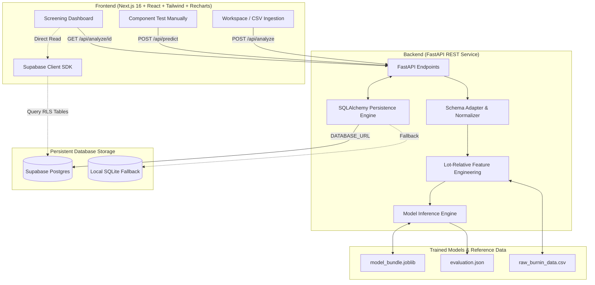
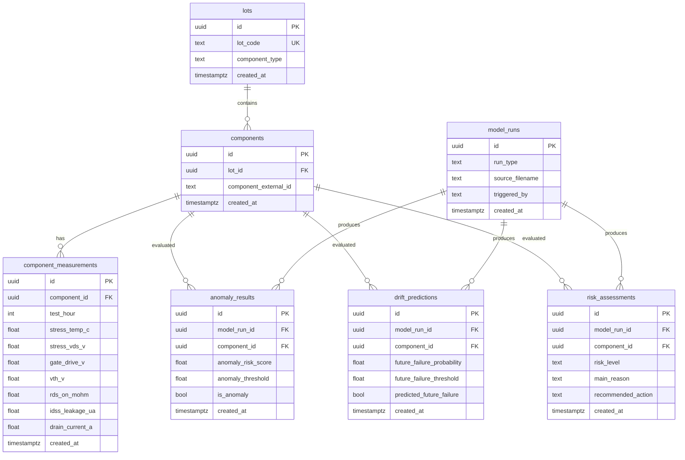

<div align="center">

# 🚀 SIH26170 — Component Reliability Intelligence Platform (CRIP)
### AI-Driven Anomaly Detection & Drift Forecasting in Component Burn-In & Screening


-emerald)


</div>

<br>

> **Executive Overview:**
> Traditional component screening relies on static datasheet thresholds (`PASS if measurement ∈ [min, max]`), which fails to detect components with latent defects that remain within absolute bounds but diverge anomalously from their manufacturing lot or drift toward early breakdown. 
> **CRIP** implements lot-relative statistical z-score feature engineering, unsupervised anomaly detection (**Isolation Forest**), and supervised degradation horizon forecasting (**HistGradientBoosting**) to identify high-risk parts at the **72-hour screening checkpoint**, forecasting failure at the **120h/168h burn-in horizon**, backed by persistent **Postgres / Supabase** storage and explainable QA-inspector metrics.

---

## 📑 Table of Contents

1. [System Architecture](#1-system-architecture)
2. [Trained ML Pipeline (`sih_mosfet_ml_v2`)](#2-trained-ml-pipeline-sih_mosfet_ml_v2)
3. [Persistent Database Storage (Supabase / Postgres)](#3-persistent-database-storage-supabase--postgres)
4. [Data Integrity & Conflict Prevention Rules](#4-data-integrity--conflict-prevention-rules)
5. [Repository Structure](#5-repository-structure)
6. [API Specification](#6-api-specification)
7. [User Interface & Workflows](#7-user-interface--workflows)
8. [Quickstart & Local Setup](#8-quickstart--local-setup)
9. [Verification & Test Results](#9-verification--test-results)

---

## 1. System Architecture

The repository is organized into a clean, decoupled two-tier architecture:



---

## 2. Trained ML Pipeline (`sih_mosfet_ml_v2`)

The core intelligence layer evaluates high-reliability N-channel power MOSFETs (modeled on the **Infineon IRF540N** standard: $V_{DS} \le 100\text{V}$, $V_{GS(th)} \in [2.0\text{V}, 4.0\text{V}]$, $R_{DS(on)} \le 44\text{ m}\Omega$, $I_{DSS} \le 250\ \mu\text{A}$).

### Feature Engineering
Features are constructed from time-series measurements at $t=0\text{h}$ and $t=72\text{h}$:
1. **Delta Dynamics:** $\Delta V_{GS(th)}$, $\Delta R_{DS(on)}$, $\Delta I_{DSS}$, $\Delta I_D$.
2. **Normalized Degradation Slopes:** $\Delta R_{DS(on)} / \Delta t$, $\Delta I_{DSS} / \Delta t$.
3. **Lot-Relative Z-Scores:** $Z_x = \frac{x - \mu_{\text{lot}}}{\sigma_{\text{lot}}}$ for all key electrical parameters. Any lot with $\ge 2$ units is dynamically scored; degenerate lots fallback safely to population dispersion.

### Models & Calibrated Decision Boundaries
- **Anomaly Detection (Unsupervised):** `Isolation Forest` with `RobustScaler`.
  - **Calibrated Threshold:** `0.4471` (tuned for $\le 1\%$ false-positive rate on validation lot `L08`).
  - **Performance:** Test Recall: **95.0%**, Precision: **84.4%**, F1 Score: **0.894**, Grouped 5-Fold CV F1: $0.927 \pm 0.007$.
- **Drift Prediction (Supervised Horizon Forecasting):** `HistGradientBoostingClassifier`.
  - **Decision Threshold:** `0.1400` (cost-optimized: missed defective unit weighted $5\times$ over false alarm).
  - **Performance:** Test ROC-AUC: **0.969**, Test Accuracy: **98.6%**, Grouped 5-Fold CV ROC-AUC: $0.978 \pm 0.009$.

---

## 3. Persistent Database Storage (Supabase / Postgres)

To ensure that screening analyses, model evaluations, and component runs survive page reloads and browser refreshes, the platform integrates with **Supabase (PostgreSQL)** via an idempotent schema ([supabase/schema.sql](file:///c:/Users/ASUS/Desktop/SIH(main)/supabase/schema.sql)).

### Schema Design (7 Core Relational Tables)



### Key Database Features
- **UUID Primary Keys:** All entities use standard UUIDs (`gen_random_uuid()`).
- **Relational Integrity:** Foreign keys enforce `ON DELETE CASCADE`.
- **Row Level Security (RLS):** Enabled across all 7 tables with authenticated team access policies.
- **Automated Fallback:** The backend connects to `DATABASE_URL` if set; if unset, it automatically provisions and uses local persistent SQLite storage (`backend/burnin_storage.db`).

---

## 4. Data Integrity & Conflict Prevention Rules

The platform implements strict reliability-engineering data policies:

1. **No Silent Overwrites:**
   - There is a unique constraint on `(component_id, test_hour)` in `component_measurements`.
   - When a dataset is uploaded, any record whose `(component_id, test_hour)` already exists in the database is **flagged as a conflict and skipped rather than silently overwritten**.
   - The conflict count and individual component checkpoint identifiers are captured and returned in `rejection_summary`.
2. **Missing Field Rejection:**
   - Any measurement row missing mandatory numerical parameters (`vth_v`, `rds_on_mohm`, `idss_leakage_ua`, `drain_current_a`, `test_hour`) is rejected, preventing pipeline distortion.
3. **Visual Integrity Audit:**
   - If conflicts or malformed rows occur, the Workspace UI surfaces a prominent conflict banner detailing the exact number of skipped records and their audit logs.
4. **No Hardcoded Summary Widgets:**
   - All dashboard widgets (lot health, failure mode distribution, high-risk alert feeds, paginated component table) execute live queries against database records. Empty states are displayed cleanly when no runs exist.

---

## 5. Repository Structure

```text
SIH(main)/
├── backend/
│   ├── dataset/                 # Synthetic & benchmark burn-in datasets
│   │   ├── burn_in_synthetic_v1.csv
│   │   └── synthetic_burnin_data.csv
│   ├── ml/                      # ML training, feature extraction, evaluation
│   │   ├── data/                # Reference raw & 72h feature tables
│   │   │   ├── raw_burnin_data.csv
│   │   │   └── features_72h.csv
│   │   ├── models/              # Serialized ML bundle & metadata
│   │   │   ├── model_bundle.joblib
│   │   │   └── metadata.json
│   │   ├── reports/             # Official cross-validation metrics
│   │   │   └── evaluation.json
│   │   ├── config.py
│   │   ├── features.py          # Schema validation & lot z-score engine
│   │   ├── predict.py           # Single-part & batch scoring
│   │   └── train.py             # GroupKFold calibration & training script
│   ├── burnin_storage.db        # Local SQLite storage (git ignored)
│   ├── db.py                    # SQLAlchemy ORM models, Supabase/SQLite engine
│   ├── main.py                  # FastAPI REST server & schema adapters
│   └── requirements.txt         # Python dependencies
├── frontend/
│   ├── src/
│   │   ├── app/
│   │   │   ├── (app)/
│   │   │   │   ├── dashboard/   # Live Screening Dashboard
│   │   │   │   ├── upload/      # Ingest CSV & Component Test Manually
│   │   │   │   └── ...
│   │   ├── components/          # Glassmorphic UI design system
│   │   ├── lib/
│   │   │   └── supabase.ts      # Supabase client SDK & direct query helpers
│   │   └── services/
│   │       └── api.ts           # Unified frontend API service
│   ├── package.json
│   └── tailwind.config.ts
├── supabase/
│   └── schema.sql               # Production PostgreSQL DDL with RLS & indexes
├── .env.example                 # Template for Supabase & Database credentials
├── .gitignore
└── README.md
```

---

## 6. API Specification

FastAPI runs on `http://127.0.0.1:8000`:

| Method | Endpoint | Description |
|---|---|---|
| `POST` | `/api/analyze` | Accepts CSV or `?use_sample=true`. Validates, engineers features, scores with ML bundle, persists run to DB, and returns summary stats + conflict logs. |
| `POST` | `/api/predict` | Evaluates a single component at 72h against reference lot distribution. Persists to `model_runs` (`single_component_test`) and returns risk prediction. |
| `GET` | `/api/analyze/{id}` | Fetches full analysis data (summary, lots, alerts, components) directly from persistent database. Supports `latest`. |
| `GET` | `/api/db/runs` | Returns historical model runs stored in the database for audit tracking. |
| `GET` | `/api/model/metrics` | Returns official `evaluation.json` metrics (recall, ROC-AUC, threshold calibrations, grouped cross-validation). |
| `GET` | `/api/dataset/sample-template` | Downloads a standard formatted sample CSV template for testing. |

---

## 7. User Interface & Workflows

### 1. Workspace (`/upload`)
- **Batch Dataset Upload:**
  - Drag-and-drop CSV upload or one-click **"Load Full 10-Lot Screening Dataset (5,000 Parts)"**.
  - Flexible column normalizer supporting wide and long burn-in formats.
  - Displays real DB ingestion metrics: parts monitored, measurements written, anomalies flagged, predicted failures.
  - Displays data integrity conflict callouts if duplicate checkpoints exist.
  - Direct **[Download Sample Template CSV]** link.
- **Component Test Manually (Real-Time Inference):**
  - Allows manual parameter entry for individual component evaluation.
  - Healthy, Leakage Drift, RDS Drift, and Vth Drift presets.
  - Live inference returns risk tier (`CRITICAL`, `HIGH`, `MEDIUM`, `LOW`), anomaly score, failure probability, primary degradation driver, and persistent storage confirmation badge.
- **Model Performance & Calibration Collapsible Section:**
  - Displays official `sih_mosfet_ml_v2` metrics directly from `reports/evaluation.json`.
  - GroupKFold CV table and Infineon IRF540N physical datasheet reference limits.

### 2. Live Screening Dashboard (`/dashboard`)
- **Persistent Header:** Displays active `analysis_id` and **"Persistent DB Storage"** indicator. Survives page reloads.
- **KPI Metrics:** Total Monitored, Anomalies Flagged, Critical Parts, High Risk Parts, 120h Failures.
- **Failure Mode Distribution:** Bar chart breaking down identified degradation patterns (Leakage Drift, RDS Drift, Vth Drift, General Degradation).
- **Manufacturing Lots Breakdown:** Visual lot cards with anomaly flags and critical counts.
- **Priority Alerts Feed:** Immediate screening hold recommendations for critical units.
- **Component Filter & Search Table:** Full pagination, search by ID or lot, and multi-parameter sorting.

---

## 8. Quickstart & Local Setup

### Prerequisites
- **Python 3.10+** with `venv`
- **Node.js 18+** and `npm`

### 1. Backend Setup
```bash
# Navigate to repository root
cd "SIH(main)"

# Activate Python virtual environment
# Windows:
venv\Scripts\activate
# Linux/macOS:
source venv/bin/activate

# Install dependencies
pip install -r backend/requirements.txt

# (Optional) Configure Supabase Database
# Copy .env.example to .env and provide your Supabase credentials:
# DATABASE_URL=postgresql://postgres:[PASSWORD]@[HOST]:5432/postgres
# If DATABASE_URL is not provided, the backend automatically uses persistent local SQLite!

# Start FastAPI server
cd backend
python -m uvicorn main:app --host 127.0.0.1 --port 8000 --reload
```
The backend API is now running at `http://127.0.0.1:8000` (docs at `http://127.0.0.1:8000/docs`).

### 2. Supabase Setup (Optional for Cloud Postgres)
1. Open your project on [Supabase](https://supabase.com).
2. Navigate to the **SQL Editor**.
3. Copy and paste the contents of [`supabase/schema.sql`](file:///c:/Users/ASUS/Desktop/SIH(main)/supabase/schema.sql) and execute.
4. Add your project URL, anon key, and connection string to `.env` in the root and `frontend/.env.local`.

### 3. Frontend Setup
```bash
# Navigate to frontend directory
cd "SIH(main)/frontend"

# Install Node dependencies
npm install

# Start Next.js development server
npm run dev
```
Open `http://localhost:3000` in your browser.

---

## 9. Verification & Test Results

The platform has been validated end-to-end:

| Test Scenario | Verification Method | Result |
|---|---|---|
| **Batch Ingestion & Scoring** | Upload 5,000-part 10-lot reference dataset | `HTTP 200 OK` — 5,000 components scored, 10,000 measurements stored, 437 anomalies flagged |
| **No Silent Overwrite** | Re-upload dataset with existing `(comp_id, test_hour)` | Duplicate rows detected and skipped; conflicts logged in `rejection_summary` |
| **Malformed Data Rejection** | Upload CSV missing required numerical columns | `HTTP 422 DataQualityError` returned with detailed missing field message |
| **Component Test Manually** | Execute real-time inference with Leakage preset | `HTTP 200 OK` — `CRITICAL` risk flagged, recorded in `model_runs` (`single_component_test`) |
| **Refresh Persistence** | Navigate to `/dashboard` and trigger hard page reload | Analysis loads directly from persistent database; all KPIs, charts, and tables retained |
| **Model Evaluation** | Dynamic query to `/api/model/metrics` | Recall = 0.950, ROC-AUC = 0.969, CV F1 = 0.927 matching `evaluation.json` |

---

<div align="center">

*Component Reliability Intelligence Platform (CRIP) • Smart India Hackathon (SIH26170)*

</div>
